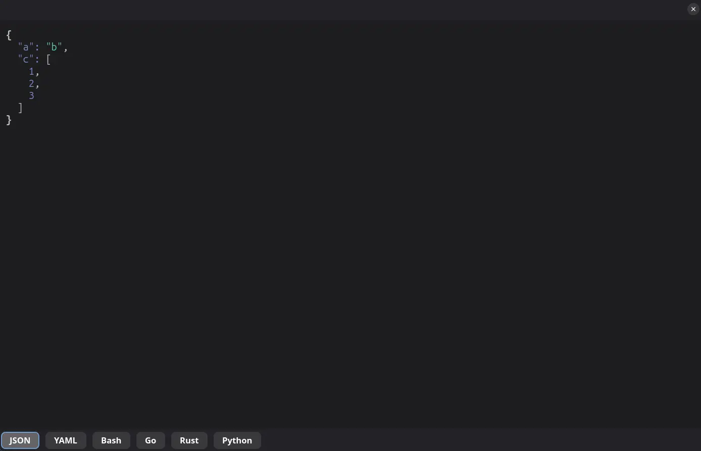
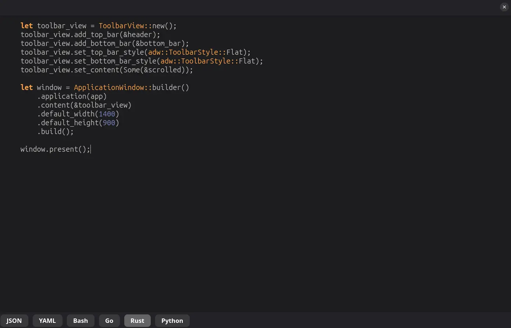

# scratchpad

Scratchpad for when you need to edit/note snippets.

## Features

- Syntax highlighting (JSON, YAML, Bash, Go, Rust, Python)
- Convert between JSON and YAML

## Install

```bash
make install
```

## Development

### Pre-reqs

```bash
sudo apt install -y \
    flatpak-builder \
    meson \
    ninja-build \
    libgtk-4-dev \
    libadwaita-1-dev \
    libgtksourceview-5-dev

flatpak install flathub org.gnome.Platform//50 org.gnome.Sdk//50 -y
flatpak install flathub org.freedesktop.Sdk.Extension.rust-stable//24.08 -y
```

### Usage

```bash
cargo run
```


## Screenshots



